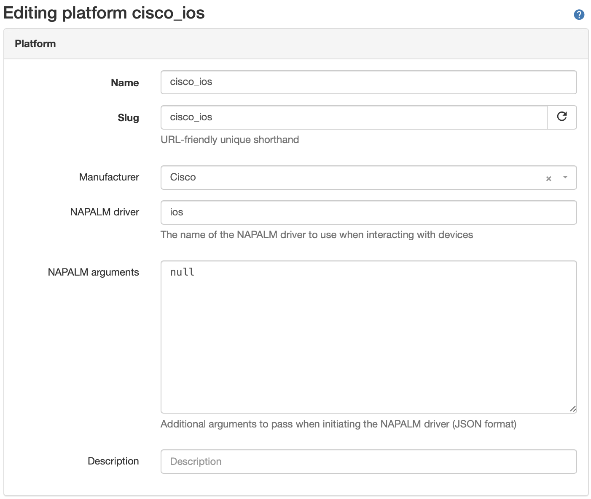
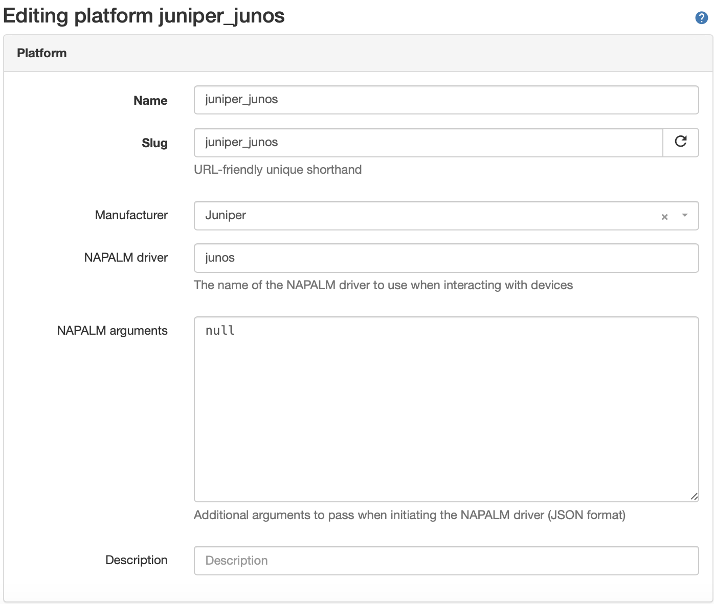
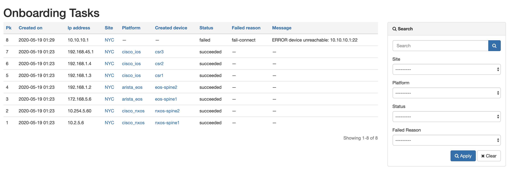
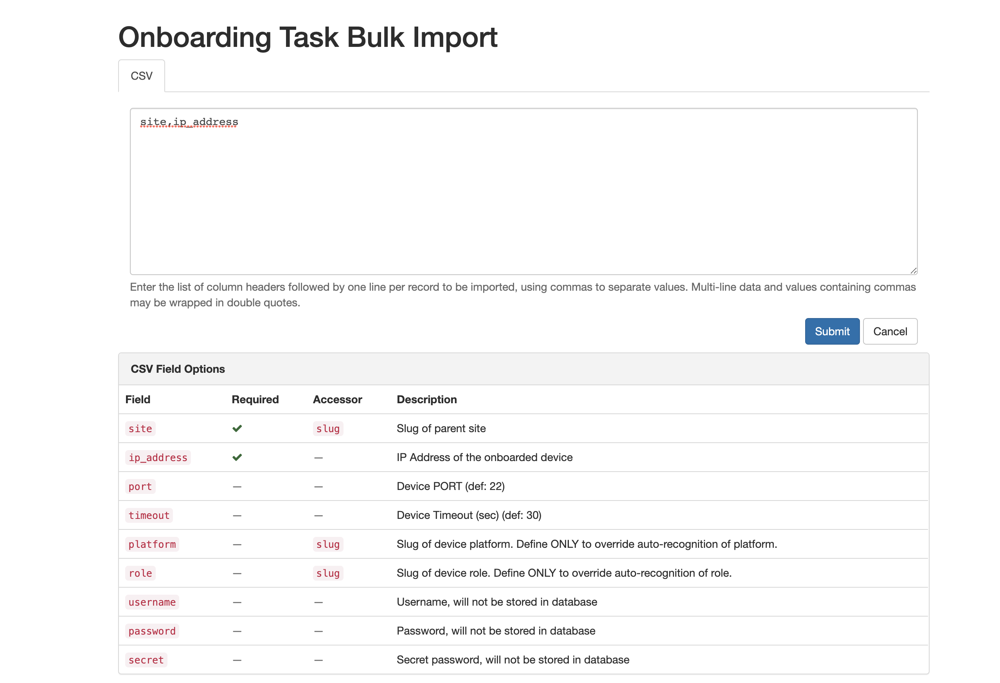
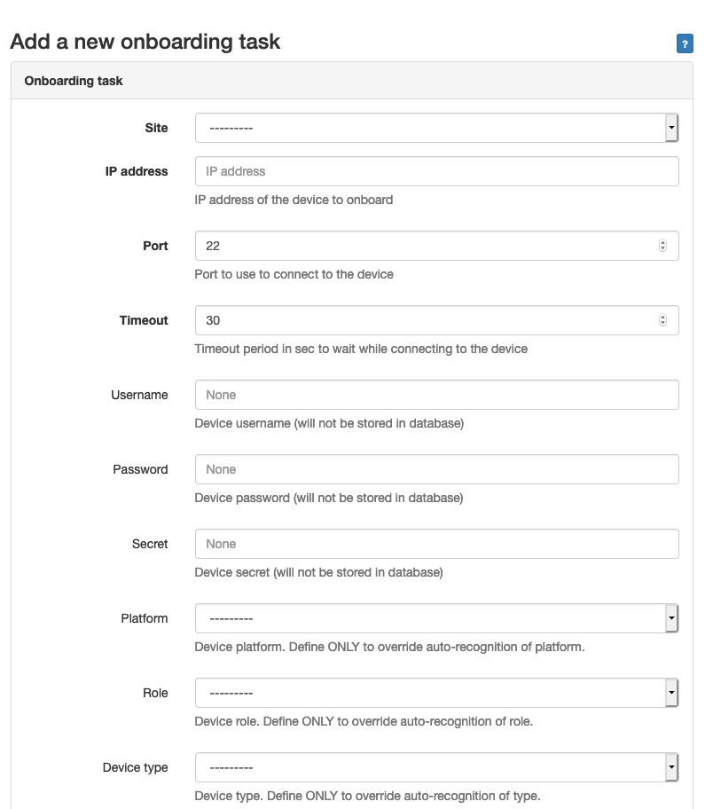
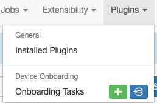

# Using the App

## General Usage

### Preparation

To properly onboard a device, user needs to provide, at a minimum:

1. The Device's Site
2. The Device's primary IP address or DNS Name

!!! note
    For DNS Name Resolution to work, the instance of Nautobot must be able to resolve the name of the device to IP address.

If other attributes (`Platform`, `Device Type`, `Device Role`) are provided in the onboarding task, the plugin will use provided value for the onboarded device.

If `Platform`, `Device Type` and/or `Device Role` are not provided, the plugin will try to identify these information automatically and, based on the settings, it can create them in Nautobot as needed.

!!! note
    If the Platform is provided, it must point to an existing Nautobot Platform. NAPALM driver of this platform will be used only if it is defined for the platform in Nautobot.
    To use a preferred NAPALM driver, either define it in Nautobot per platform or in the plugins settings under `platform_map`.

#### SSH Autodetect

Plugin recognizes platform types with a Netmiko SSH Autodetect mechanism. The user will need to specify additional information for platforms where Netmiko's `ssh_autodetect` feature does not work.

[Here is the list](https://github.com/ktbyers/netmiko/blob/v3.4.0/netmiko/ssh_autodetect.py#L50) of platforms supported by `ssh_autodetect`.

The `nautobot-device-onboarding` plugin can be used with any devices that are supported by NAPALM. Even custom NAPALM driver plugins can be used with a bit of effort.

Devices that are supported by NAPALM but are not running SSH or don't have support for `ssh_autodetect` will still work with this plugin, but will require some additional information in the onboarding task.

The table below shows which common platforms will be SSH auto-detected by default.

|Platform     |Platform Autodetect|
--------------|--------------------
Juniper/Junos | Yes (when running Netconf over SSH)|
Cisco IOS-XE  |Yes|
Cisco NXOS (ssh) | Yes|
Cisco NXOS (nxapi)| No|
Arista EOS | No|

For the platforms where SSH auto-detection does not work, the user will need to:

1. Manually define a Platform in Nautobot (this will be a one-time task in order to support any number of devices using this Platform)
2. During onboarding, a Port and Platform must explicitly be specified (in addition to the IP and Site)

### IOS and Junos Auto-Created Platforms

The Onboarding Plugin will automatically create Platforms for vendor operating systems where platform auto-detection works. The picture below shows the details of auto-created Platforms for `cisco_ios` and `juniper_junos`.

## Use-cases and common workflows

### Create a New Platform

This section demonstrates how to create a new Platform in the Nautobot UI. Specifically, it offers examples for creating platforms for Cisco `nxapi` and Arista `eos` devices, but the concepts are applicable to any Platform that is manually created.

- In the Nautobot dropdown menu, go to `Devices--> Platforms--> Add/+`.
- Define the attributes for the Platform on this screen and click on the 'Create' button.
- 'Manufacturer' and 'NAPALM arguments' are optional.

!!! note
    The Slug value will be auto-populated based on the Platform Name, but you can overwrite that auto-populated value. For the platform to work correctly with this plugin, in many cases you will need to set a specific Slug value for it to work properly.

#### Cisco NXOS Platform

A Platform that will work with NXOS devices running the `nxapi` feature must have specific values for these attributes:

- `Slug` **SHOULD** be `cisco_nxos` (you may have to overwrite the auto-populated Slug value).
- `NAPALM driver` **MUST** be `nxos`.

#### Arista EOS Platform

A Platform that will work with Arista EOS devices must have specific values for these attributes:

- `Slug` **SHOULD** be `arista_eos` (you may have to overwrite the auto-populated Slug value).
- `NAPALM driver` **MUST** be `eos`.

### Onboard a New Device

A new device can be onboarded via :

- A web form  `/plugins/device-onboarding/add/`
- A CSV form to import multiple devices in bulk. `/plugins/device-onboarding/import/`
- An API, `POST /api/plugins​/device-onboarding​/onboarding​/`

During a successful onboarding process, a new device will be created in Nautobot with its management interface and its primary IP assigned. The management interface will be discovered on the device based on the IP address provided.

!!! note
    By default, the plugin is using the credentials defined in the main `configuration.py` for Napalm (`NAPALM_USERNAME`/`NAPALM_PASSWORD`). It's possible to define specific credentials for each onboarding task.

### Onboard a Cisco NXOS Device Running the `nxapi` Feature

When onboarding an NXOS device with the `nxapi` feature, there are a few requirements:

- The `Port` must be the same value configured for `nxapi https port` on the Cisco Nexus device
- The `Platform` must be explicitly set to be one with the specific parameters in the [Cisco NXOS Platform](#cisco-nxos-platform) section

### Onboarding an Arista EOS Device

When onboarding an Arista EOS device, there are a few requirements:

- The `Port` must be the same value configured for HTTPS on the Arista device
- The `Platform` must be explicitly set to be the one with the specific parameters in the [Arista EOS Platform](#arista-eos-platform) section

### Consult the Status of Onboarding Tasks

The status of the onboarding process for each device is maintained is a dedicated table in Nautobot and can be retrived :
- Via the UI `/plugins/device-onboarding/`
- Via the API `GET /api/plugins​/device-onboarding​/onboarding​/`

## Screenshots

### List of Onboarding Tasks

### CSV form to import multiple devices

### Onboard a single device

### Menu

